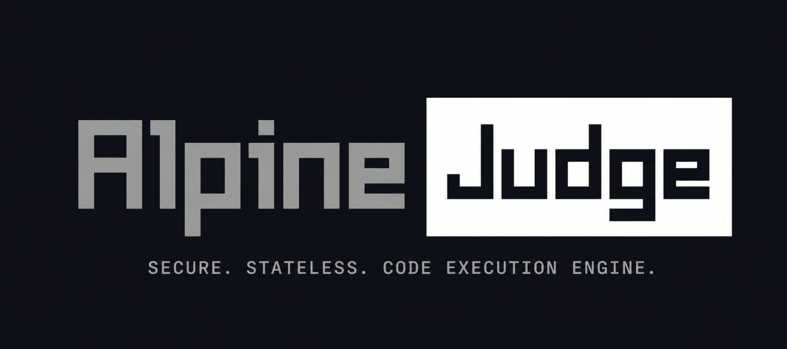
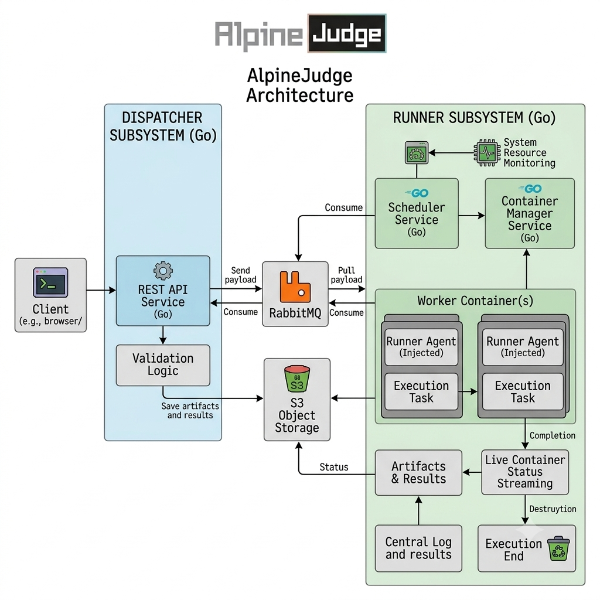

# AlpineJudge



A stateless, secure, multi-language code execution engine built for high performance and easy deployment.


## Table of Contents
* [About](#about)
* [Getting Started](#getting-started)
* [Example Usage](#example-usage)
* [Architecture & Design Philosophy](#architecture--design-philosophy)
* [Key Capabilities](#key-capabilities)
* [Non Goals](#non-goal)
* [Documentation](#documentation)


## About

Running untrusted code is not just execution — it is a security problem.

Most systems struggle with:
- unsafe container escape risks
- inconsistent runtime environments
- resource abuse (CPU/memory/time)
- lack of controlled and reliable execution orchestration

AlpineJudge solves this by treating code execution as a hardened infrastructure layer rather than a simple runtime task.


## Getting Started

AlpineJudge has two stage deployment 

### Stage 1 - Install the AlpineJudge system
```bash
git clone git@github.com:smsadat1/AlpineJudge.git
cd AlpineJudge
cp .env.example .env
docker compose up --build
```

### Stage 2 — Python SDK and  language image

Install the SDK:

```bash
pip install alpinejudge-sdk
ctr -n ajnamespace images pull ghcr.io/smsadat1/alpinejudge/master:v0.1.0

```

Submit a job:

```python
import asyncio
from alpinejudge import AlpineJudge

async def main():

    client = AlpineJudge() 
    await client.upload_testset(testset_path='path/to/testset', testset_id='testset_id')

    with open("program.cpp", "r", encoding="utf-8") as file:
        file_string = file.read()

    async for event in client.submit_and_watch(
        submission_id="submission_id",
        language="cpp",
        source= file_string,
        testset_id="ts001",
        memory_limit_mb=1024,
        timeout_sec=20,
        log_limit_kb=1024,
    ):
        print(f"{event.type} {event.status} {event.details}")


if __name__ == "__main__":
    asyncio.run(main())
```

See the [Python SDK documentation](docs/sdk/pythonexamples.md) for more examples.

---

## Architecture & Design Philosophy



AlpineJudge is designed around statelessness, isolation, predictability and reproducibility when executing untrusted code.

The system prioritizes:
  - strong runtime isolation
  - deterministic execution environments
  - clear separation of concerns across services


## System overview

AlpineJudge is composed of two subsystems:

 - Dispatcher -> request handling and orchestration 
 - Runner -> isolated code execution engine

Execution flow: 

  ` Client -> Dispatcher -> RunnerService -> Ajagent inside container `

## Key Capabilities

  - Multi-language execution (Python, C/C++, Go, Java, JS)
  - Secure sandboxed execution using containerd containers
  - SSE based execution status streaming


## Non-Goal 
AlpineJudge is not a contest management platform. 
It intentionally remains stateless and does not manage users, contests, submissions, or persistent application data. 
Those responsibilities belong to the integrating application. 
AlpineJudge focuses solely on validating, scheduling, executing, and evaluating code submissions.

## Documentation

Detailed technical documentation is available in `/docs`:

  - Architecture -> `docs/ARCHITECTURE.md`
  - API references -> `docs/API.md`
  - Design decisions -> `docs/ADRs`
  - Subsystem documentation (dispatcher) -> `docs/subsystems/dispatcher.md`
  - Subsystem documentation (runner) -> `docs/subsystems/runner`
